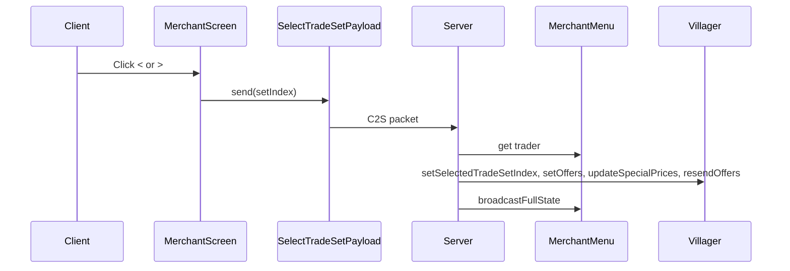
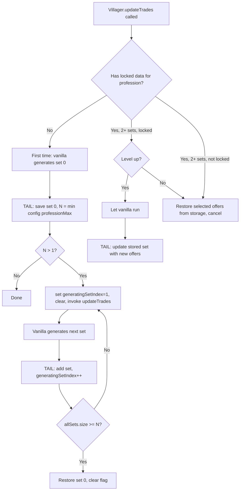

# Locked Villager Trades

A Fabric mod for Minecraft 1.21.10 that locks villager trades to the first trade set that appears for each profession. Break and replace workstations or switch professions—trades stay the same.

This README serves as a technical reference for agents extending the mod. It documents the architecture, vanilla interception points, data flow, and extension points.

---

## 1. Overview and Vanilla Context

**What the mod does:** When a villager first acquires a profession, the mod generates N trade set options (configurable, default 2). The player chooses one via a caret UI (`< Trades N >`) before completing any trade. The number of options is capped per profession: e.g. Weaponsmiths have ~3, Librarians support many more. Once a trade is completed, that selection is locked and persists across workstation breaks/replacements and profession changes.

**Vanilla behavior (baseline):** Villagers regenerate trades on `updateTrades()` when opening the trade UI, leveling up, or after restocking. Trades are random per profession/level.

**Key vanilla classes involved:**

- `Villager` – entity, holds `MerchantOffers`, calls `updateTrades()`
- `AbstractVillager.notifyTrade()` – called when a trade is completed
- `MerchantMenu` – container for the trade screen, syncs via `ContainerData`
- `MerchantScreen` – client UI, renders "Trades" label and experience bar

---

## 2. Interception Points (Where Vanilla Is Hooked)

| Vanilla Target | Mixin | Injection Point | Purpose |
|----------------|-------|-----------------|---------|
| `Villager.updateTrades()` | [VillagerTradesMixin](src/main/java/locked_villager_trades/mixin/VillagerTradesMixin.java) | HEAD (cancellable), TAIL | Restore locked offers instead of regenerating; on first profession, generate N sets (from config, capped by profession); on level-up, let vanilla run then update stored data |
| `AbstractVillager.notifyTrade()` | [VillagerTradeLockMixin](src/main/java/locked_villager_trades/mixin/VillagerTradeLockMixin.java) | TAIL | Lock the current trade set and record level when player completes first trade |
| `Villager.addAdditionalSaveData` / `readAdditionalSaveData` | [VillagerPersistMixin](src/main/java/locked_villager_trades/mixin/VillagerPersistMixin.java) | TAIL | Persist `lockedTrades` map via ValueOutput/ValueInput (1.21.10+) |
| `MerchantMenu.<init>` | [MerchantMenuMixin](src/main/java/locked_villager_trades/mixin/MerchantMenuMixin.java) | TAIL | Add 3 `ContainerData` slots (selectedIndex, locked, maxTradeSetIndex) for client sync when villager has 2+ trade sets |
| `AbstractContainerScreen.init` | [MerchantScreenMixin](src/client/java/locked_villager_trades/mixin/client/MerchantScreenMixin.java) | TAIL | Add trade set selector UI (`<`, label, `>`) when `canSelectTradeSet()` |
| `MerchantScreen.renderProgressBar` | [MerchantScreenRenderMixin](src/client/java/locked_villager_trades/mixin/client/MerchantScreenRenderMixin.java) | HEAD (cancellable) | Hide vanilla XP bar when mod manages trades |

---

## 3. UI Architecture

### 3.1 Where the UI Code Lives

All UI code is **client-only** and lives under `src/client/`:

| Path | Role |
|------|------|
| [MerchantScreenMixin](src/client/java/locked_villager_trades/mixin/client/MerchantScreenMixin.java) | Injects the trade set selector (`<`, label, `>`) into the merchant screen |
| [MerchantScreenRenderMixin](src/client/java/locked_villager_trades/mixin/client/MerchantScreenRenderMixin.java) | Hides the vanilla experience bar when the mod manages 2+ trade sets |
| [TradeIndexLabel](src/client/java/locked_villager_trades/client/TradeIndexLabel.java) | Custom widget that displays the current trade set index (1-based) |
| [ScreenAccessorMixin](src/client/java/locked_villager_trades/mixin/client/ScreenAccessorMixin.java) | Accessor to call `addRenderableWidget` (otherwise inaccessible) |

These mixins are registered in `locked_villager_trades.client.mixins.json` and only load in the client environment.

### 3.2 How the UI Interacts with the Vanilla Merchant Screen

**Vanilla layout:** `MerchantScreen` extends `AbstractContainerScreen<MerchantMenu>`. It renders a "Trades" label at the top, trade slots below, and an experience bar (`renderProgressBar`) that shows villager level progress.

**Mod additions:**

1. **MerchantScreenMixin** targets `AbstractContainerScreen.init` (TAIL). It runs only when:
   - The screen is a `MerchantScreen`
   - The menu implements `LockedTradesMenuAccessor` (i.e. `MerchantMenu` with our mixin)
   - `canSelectTradeSet()` is true (2+ trade sets, not yet locked)

   It adds three widgets in a row after the vanilla "Trades" label:
   - **Left caret button** (`<`) – sends `SelectTradeSetPayload` with `index - 1`
   - **TradeIndexLabel** – shows current index (1-based), reads from `LockedTradesMenuAccessor`
   - **Right caret button** (`>`) – sends `SelectTradeSetPayload` with `index + 1`

   Layout constants: `TRADE_SELECTOR_X = 18`, `TRADE_SELECTOR_Y = 4`, `CARET_BUTTON_SIZE = 12`, `TEXT_CONTAINER_WIDTH = 42`.

2. **MerchantScreenRenderMixin** targets `MerchantScreen.renderProgressBar` (HEAD, cancellable). When `shouldHideExperienceBar()` is true (villager has 2+ trade sets), it cancels the vanilla XP bar render so the selector area is not cluttered.

3. **TradeIndexLabel** extends `AbstractWidget`. It holds a reference to `MerchantMenu` and reads `getSelectedTradeSetIndex()` from `LockedTradesMenuAccessor` each frame in `renderWidget`. The index is synced from server via `ContainerData` (see §5).

### 3.3 Interaction with the Vanilla Trade Graph

The mod **does not modify** the vanilla trade graph (the registry of trade offer factories per profession/level). It only controls *when* vanilla generates trades and *what* is displayed:

- **Trade generation:** Vanilla `Villager.updateTrades()` uses the built-in trade graph to produce `MerchantOffers`. The mod calls this method repeatedly (via `VillagerAccessorMixin.invokeUpdateTrades`) to generate N distinct trade sets; each call yields a new random set from the same graph.
- **Display:** The UI reads `selectedIndex` and `locked` from `MerchantMenu` (synced via `ContainerData`). The actual offers shown in the trade slots come from `Villager.getOffers()` – the server swaps these when the player clicks `<`/`>` or when the menu syncs.
- **No graph changes:** The mod never adds, removes, or alters trade offer factories. It only stores and restores `MerchantOffers` instances that vanilla generated.

---

## 4. Accessor Mixins (No Behavior Change)

These expose otherwise-inaccessible methods/fields for the mod to use:

- **MerchantMenuAccessorMixin** – `trader` field on `MerchantMenu`
- **AbstractContainerMenuAccessorMixin** – `addDataSlots(ContainerData)` on `AbstractContainerMenu`
- **VillagerAccessorMixin** – invokers: `resendOffersToTradingPlayer()`, `updateTrades()`, `updateSpecialPrices(Player)`
- **ScreenAccessorMixin** – invoker: `addRenderableWidget(T)`

---

## 5. Data Model and Persistence

- **LockedTradeData** (record): `tradeSets` (List of MerchantOffers), `selectedIndex` (0 to tradeSets.size()-1), `locked` (boolean), `lockedLevel` (int)
- **Storage**: `Map<VillagerProfession, LockedTradeData>` on each Villager via [VillagerPersistMixin](src/main/java/locked_villager_trades/mixin/VillagerPersistMixin.java)
- **Serialization**: [LockedTradesStorage](src/main/java/locked_villager_trades/util/LockedTradesStorage.java) – uses `ValueOutput`/`ValueInput` with Codec; supports legacy single-offer format
- **ContainerData sync**: `MerchantMenuMixin` adds 3 slots: index 0 = selectedIndex, index 1 = locked (1/0), index 2 = maxTradeSetIndex. Client reads these for UI; server writes via networking

---

## 6. Gossip and Reputation System

Vanilla Minecraft uses a **GossipContainer** on each villager to track reputation per player. Reputation affects trade prices: positive reputation (trading, curing zombie villagers, defeating raids) gives discounts; negative reputation (attacking villagers) increases prices. The formula combines base price, demand, and reputation. Vanilla applies these via `Villager.updateSpecialPrices(Player)`, which adjusts the `specialPrice` on each `MerchantOffer` based on the villager's gossip for that player.

**What the mod does NOT do:**

- Does not persist or modify `GossipContainer` / reputation data
- Does not store player-specific special prices in `LockedTradeData`
- Stored `MerchantOffers` are base offers (with demand/restock state); reputation is not baked in

**What the mod does to preserve vanilla behavior:**

- After restoring offers (`setOffers(copy)`), the mod always calls `updateSpecialPrices(tradingPlayer)` so the current player's reputation is applied
- This happens in two places:
  1. [Locked_villager_trades.java](src/main/java/locked_villager_trades/Locked_villager_trades.java) – when the server receives `SelectTradeSetPayload` and swaps trade sets
  2. [MerchantMenuMixin](src/main/java/locked_villager_trades/mixin/MerchantMenuMixin.java) – when `ContainerData.set()` is called for selectedIndex (menu sync)

**Implications for agents:**

- Reputation, Hero of the Village, and demand-based pricing all work normally because the mod delegates to vanilla `updateSpecialPrices`
- To modify reputation behavior, an agent would need to intercept `Villager.updateSpecialPrices` or the `GossipContainer` API
- Stored offers use `MerchantOffers.copy()` – this preserves base costs and demand; special prices are recalculated per player on each restore

---

## 7. Networking Flow

- **Payload**: [SelectTradeSetPayload](src/main/java/locked_villager_trades/networking/SelectTradeSetPayload.java) – single `int setIndex` (0 to N-1)
- **Registration**: `PayloadTypeRegistry.playC2S().register()` in main mod init
- **Server handler**: Validates `MerchantMenu` + Villager + profession + 2+ sets + not locked; updates villager, resends offers, broadcasts menu state

---

## 8. Configurable Trade Set Generation Flow

---

## 9. File Layout for Reference

| Path | Role |
|------|------|
| [Locked_villager_trades.java](src/main/java/locked_villager_trades/Locked_villager_trades.java) | Main init, config load, payload registration, C2S handler |
| [ModConfig](src/main/java/locked_villager_trades/config/ModConfig.java) | Load/save config from `config/locked_villager_trades.json` |
| [ProfessionMaxHelper](src/main/java/locked_villager_trades/util/ProfessionMaxHelper.java) | Per-profession max trade set caps |
| [Locked_villager_tradesClient.java](src/client/java/locked_villager_trades/Locked_villager_tradesClient.java) | Client init (empty; payload in common) |
| [LockedTradesAccessor](src/main/java/locked_villager_trades/LockedTradesAccessor.java) | Interface for villager locked-trades storage |
| [LockedTradesMenuAccessor](src/main/java/locked_villager_trades/LockedTradesMenuAccessor.java) | Interface for MerchantMenu UI state |
| [LockedTradeData](src/main/java/locked_villager_trades/util/LockedTradeData.java) | Record for per-profession data |
| [LockedTradesStorage](src/main/java/locked_villager_trades/util/LockedTradesStorage.java) | Serialization + `copyOffers()` |
| [SelectTradeSetPayload](src/main/java/locked_villager_trades/networking/SelectTradeSetPayload.java) | C2S packet |
| [MerchantScreenMixin](src/client/java/locked_villager_trades/mixin/client/MerchantScreenMixin.java) | Client: injects trade set selector into merchant screen |
| [MerchantScreenRenderMixin](src/client/java/locked_villager_trades/mixin/client/MerchantScreenRenderMixin.java) | Client: hides vanilla XP bar when mod manages trades |
| [TradeIndexLabel](src/client/java/locked_villager_trades/client/TradeIndexLabel.java) | Client widget for "Trades N" display |

---

## 10. Extension Points for Agents

- **Configuration**: Edit `config/locked_villager_trades.json` – `trade_set_count` (1–20) controls how many options uninitialized villagers offer; effective count is `min(config, profession_max)`
- **Custom profession caps**: Extend [ProfessionMaxHelper](src/main/java/locked_villager_trades/util/ProfessionMaxHelper.java) to add limits for mod-added professions (default fallback: 10)
- **UI changes**: Modify [MerchantScreenMixin](src/client/java/locked_villager_trades/mixin/client/MerchantScreenMixin.java) (layout constants, button placement) or [TradeIndexLabel](src/client/java/locked_villager_trades/client/TradeIndexLabel.java)
- **New persistence fields**: Extend `LockedTradeData` and `LockedTradesStorage` CODEC; update `VillagerPersistMixin` if needed
- **New interception**: Add mixins to `locked_villager_trades.mixins.json` (common) or `locked_villager_trades.client.mixins.json` (client)
- **Reputation/gossip**: To change how reputation affects prices, intercept `Villager.updateSpecialPrices` or `GossipContainer`; the mod does not touch these

---

## 11. Environment and Versions

- Minecraft 1.21.10, Fabric API, Java 21
- Mixins: `locked_villager_trades.mixins.json` (common), `locked_villager_trades.client.mixins.json` (client-only)
